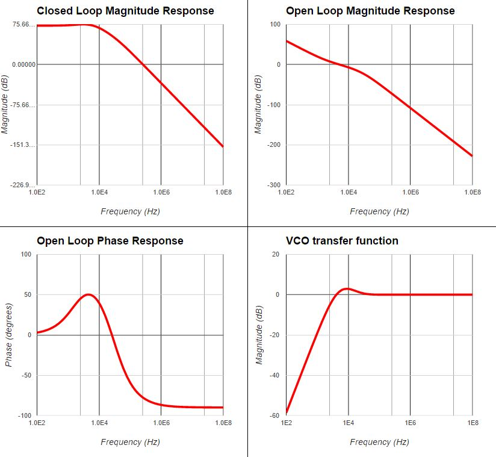
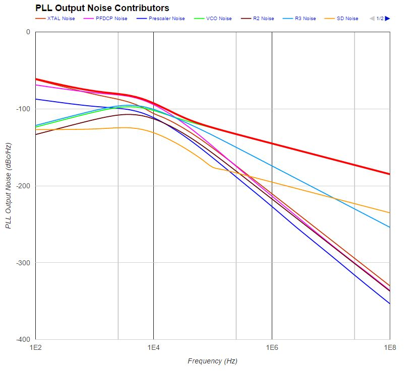
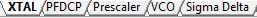
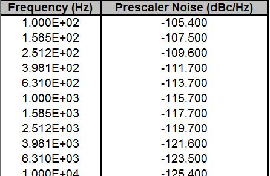
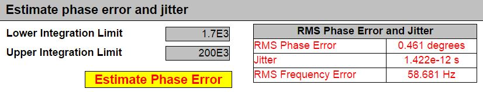
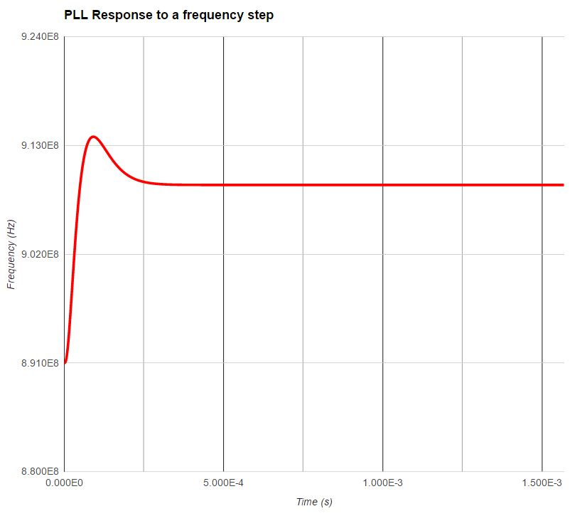
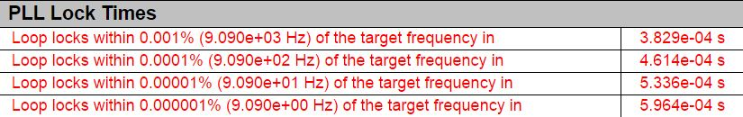
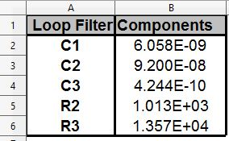
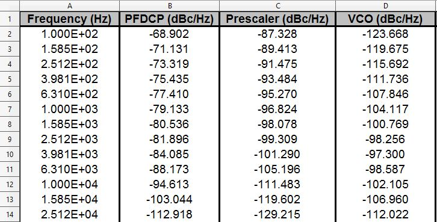

## URL
[http://pll3rdorder.appspot.com/](http://pll3rdorder.appspot.com/, "3rd-order PLL design tool")

## Motivation

I had always wanted a tool that made the iterative and laborious PLL design process **much** faster and efficient so that designers could quickly see how changing a loop parameter would impact the various figures of merit. I also wanted to make it freely available and maybe even have it run in the browser

I understood PLLs a lot better after reading Dean Banerjee's [PLL Performance Simulation and Design Handbook](http://www.ti.com/tool/pll_book), in its fourth edition at the time. He explains things very elegantly in his book, and diligently goes through the process of arranging the transfer functions, with all those s<sup>2</sup>, s<sup>3</sup>, and s<sup>4</sup> terms, in a way that makes it intuitive to see what is going on.

In 2011 I took MIT OCW's [MIT 6.00 - Introduction to Computer Science and Programming](https://ocw.mit.edu/courses/electrical-engineering-and-computer-science/6-00-introduction-to-computer-science-and-programming-fall-2008/) by professors Eric Grimson and John Guttag, which uses [Python](http://www.python.org) as a vehicle to introduce students to computer science (or reacquaint former ones: my previous programming course had been in 1993). At once fun and excruciating, I *immensely* enjoyed MIT 6.00. In 2012, I took Udacity's [CS253 - Web Development](https://www.udacity.com/course/web-development--cs253), taught by Steve Huffman, one of [Reddit's](https://www.reddit.com/) founders. I didn't get to the build-your-own-blog part, but the course did introduce me to using Python for web development in [Google App Engine](https://cloud.google.com/appengine/).

I used those three building blocks (Banerjee's book, MIT's 6.00, and Udacity's CS253) along with other modules to deliver this app.

## Technologies

**Backend**: [Python](https://www.python.org/) and Python modules [numpy](https://docs.scipy.org/doc/numpy-dev/user/quickstart.html), [xlrd](http://www.python-excel.org/), and [xlwt](http://www.python-excel.org/), [Google App Engine](https://cloud.google.com/appengine/docs/python/), [Jinja2](http://jinja.pocoo.org/) templating engine

**Frontend**: [HTML5(HTML/CSS/JavaScript)](https://www.wickedlysmart.com/head-first-html5/), [Hint.css](https://kushagragour.in/lab/hint/) for tooltips, [Google Charts](https://developers.google.com/chart/interactive/docs/gallery)

Generally speaking, the computations are done in the backend using Python and numpy, then Jinja2 populates the templates in the frontend with the results. The only computations that are done in the frontend are the phase error and jitter.

Here is an example using (a section of) the template for the Loop Filter components. On the backend, Python computes the capacitor (C) and resistor (R) values, then Jinja fetches the loop filter template and renders it:


The actual template has some placeholders, e.g., {{ C1 }}, {{ C2 }}, etc., and when Jinja renders those placeholders are replaced with the actual values of the capacitors.


## Features

Clicking on that "Evaluate PLL" button generates quite a bit of output!

### Loop filter
The tool's Python backend computes the values of the loop filter components, given the input parameters.


### Loop response transfer functions
I used Python's numpy module to compute several loop transfer functions. I used [Google Charts](https://developers.google.com/chart/interactive/docs/gallery/linechart) on the front end to plot them.




### Noise
I used Python's numpy module to compute the PLL contributions to the output noise of the various components (VCO, charge pump, and the rest of the lot), as well as the total output noise. I used [Google Charts](https://developers.google.com/chart/interactive/docs/gallery/linechart) to plot them.



### Noise sources file
The noise sources spreadsheet can be [downloaded](http://localhost:10080/download/noiseSources), modified, and uploaded so it can be used in the PLL noise computations.

The downloaded spreadheet is multi-tabbed:



Each tab has the (default) source noise generated by a loop component (crystal, prescaler, etc.). I got some of the noise data from data sheets and some from old designs that never went into production. Here is a snapshot of the prescaler:



To use your own noise data, plug in your noise values on the second (B) column of the spreadsheet for each of the components. The frequency points go from 100 Hz to 10 MHz and are log-spaced using numpy's [logspace](https://docs.scipy.org/doc/numpy-1.10.0/reference/generated/numpy.logspace.html), which as far as I can tell works identically to its [MATLAB](https://www.mathworks.com/help/matlab/ref/logspace.html) equivalent.

```
import numpy as np
freq = np.logspace(2,8,31)
```
You can get Cadence or an equivalent to write to a text file the output noise of, say, the prescaler, using the same number of points. If you don't upload your own noise data to the tool, the default noise data is used. A warning will be shown in either the HTML output or the Excel report.

### Phase error and jitter

The tool estimates the RMS phase and frequency errors as well as the jitter using the integration limits you enter. I think I integrated the noise using [Simpson's rule for numerical integration](https://en.wikipedia.org/wiki/Simpson's_rule), but I don't remember the details. I did this part in JavaScript.



### Time response

The tool's Python backend computes the time response to a frequency step and the values are plotted on the front end using [Google Charts](https://developers.google.com/chart/interactive/docs/gallery/linechart). In addition, the loop lock times and their associated tolerances are also computed.





### Excel reports

If you click on the "Generate Excel report" checkbox and then on "Evaluate PLL", an Excel report will be generated instead of the HTML5 output. This is done with the [Python-Excel](http://www.python-excel.org/) module xlwt, which allows us to write to an Excel file from Python. When I wrote this app several years ago, I had an official, albeit older, Excel version in my computer, and the Excel report generated by xlwt worked *great*. Today I just have Libre Office and it still works ok-ish. All the data is there but you have to select all the cells in each tab, click on Format->Cells...->Alignment->Shrink to fit cell size. The Excel report is generated on-the-fly when you click "Evaluate" and served, but it will not be stored anywhere.

Loop filter components sheet:



Output noise contributors sheet (section):



Excel can even do the Phase Error integration of the noise! Just change the integration limits to see the changes!


## References

1. Banerjee, Dean. [**PLL Performance Simulation and Design Handbook, Fourth Edition**](http://www.ti.com/tool/pll_book), 2006. PDF

2. Grimson, Eric and  Guttag, John. [**MIT 6.00 - Introduction to Computer Science and Programmming**](https://ocw.mit.edu/courses/electrical-engineering-and-computer-science/6-00-introduction-to-computer-science-and-programming-fall-2008/), Fall 2008. OCW.

3. Huffman, Steve. [**CS253 - Web Development**](https://www.udacity.com/course/web-development--cs253), Spring 2012, Udacity.
